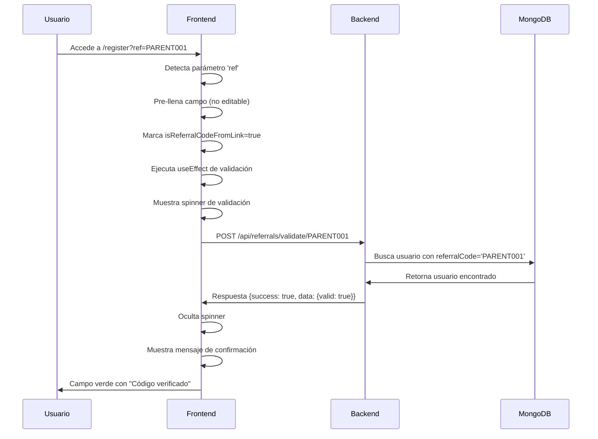

# 🔧 Solución: Registro con Enlaces de Referido

## 📋 Resumen del Problema

**Problema identificado**: Los usuarios que accedían a la página de registro a través de enlaces de referido (ej: `http://localhost:5173/register?ref=PARENT001`) experimentaban errores de validación, mostrando códigos válidos como inválidos.

**Síntomas observados**:
- ❌ Código `PARENT001` aparecía como "inválido" en el frontend
- ❌ Errores de conexión en la consola del navegador
- ❌ Validación automática no funcionaba para códigos de enlaces
- ❌ Experiencia de usuario deficiente

## 🔍 Diagnóstico Realizado

### 1. Verificación de Backend
- ✅ Endpoint `/api/referrals/validate/:code` funcionando correctamente
- ✅ Código `PARENT001` existe en la base de datos
- ✅ Usuario asociado: "Rosalba" (negociosmillonaris1973@gmail.com)
- ✅ Respuesta del API correcta:
```json
{
  "success": true,
  "data": {
    "valid": true,
    "code": "PARENT001",
    "user": {
      "id": "688bb6ec670432f1e1fe4654",
      "name": "Rosalba",
      "email": "negociosmillonaris1973@gmail.com"
    },
    "message": "Código válido"
  }
}
```

### 2. Identificación de Problemas en Frontend
- ❌ Configuración de API incorrecta en `.env.local`
- ❌ Frontend intentando conectar a VPS en lugar de backend local
- ❌ Falta de validación automática para códigos de enlaces
- ❌ Ausencia de indicadores visuales durante validación

## 🛠️ Soluciones Implementadas

### 1. Corrección de Configuración de API

**Archivo modificado**: `frontend/.env.local`

**Cambio realizado**:
```diff
- # Configuración temporal para probar con VPS
- VITE_API_URL=http://80.78.25.79:5000/api
+ # Configuración para desarrollo local
+ VITE_API_URL=http://localhost:3000/api
```

**Resultado**: Frontend ahora se conecta correctamente al backend local.

### 2. Validación Automática de Códigos de Enlaces

**Archivo modificado**: `frontend/src/pages/user/auth/Register.jsx`

**Funcionalidad agregada**:
```javascript
// Efecto para validar automáticamente el código de referido cuando viene del enlace
useEffect(() => {
  const validateReferralCodeFromLink = async () => {
    if (isReferralCodeFromLink && formData.referralCode) {
      try {
        setIsValidatingReferral(true);
        const response = await referralsService.validateReferralCode(formData.referralCode);
        
        if (response.success && response.data.valid) {
          // Código válido - limpiar cualquier error previo
          setErrors(prev => ({
            ...prev,
            referralCode: ''
          }));
        } else {
          // Código inválido - mostrar error
          setErrors(prev => ({
            ...prev,
            referralCode: 'El código de referido no es válido'
          }));
        }
      } catch (error) {
        console.error('Error validating referral code from link:', error);
        setErrors(prev => ({
          ...prev,
          referralCode: 'Error al validar el código de referido'
        }));
      } finally {
        setIsValidatingReferral(false);
      }
    }
  };

  validateReferralCodeFromLink();
}, [isReferralCodeFromLink, formData.referralCode]);
```

**Beneficios**:
- ✅ Validación automática al cargar la página
- ✅ Manejo de errores robusto
- ✅ Actualización de estado en tiempo real

### 3. Mejoras en la Interfaz de Usuario

**Indicadores visuales agregados**:

```javascript
{isValidatingReferral && (
  <div className="flex items-center mt-1 text-xs sm:text-sm text-blue-600">
    <div className="animate-spin rounded-full h-4 w-4 border-b-2 border-blue-600 mr-2"></div>
    Validando código de referido...
  </div>
)}
{!isValidatingReferral && isReferralCodeFromLink && !errors.referralCode && (
  <div className="flex items-center mt-1 text-xs sm:text-sm text-green-600">
    <AlertCircle className="w-4 h-4 mr-1" />
    Código verificado del enlace de referido
  </div>
)}
{!isValidatingReferral && errors.referralCode && (
  <div className="flex items-center mt-1 text-xs sm:text-sm text-red-600">
    <AlertCircle className="w-4 h-4 mr-1" />
    {errors.referralCode}
  </div>
)}
```

**Características**:
- 🔄 Spinner animado durante validación
- ✅ Mensaje de confirmación para códigos válidos
- ❌ Mensaje de error para códigos inválidos
- 🔒 Campo no editable para códigos de enlaces
- 🎨 Estilos diferenciados por estado

## 🧪 Pruebas Realizadas

### 1. Verificación de Base de Datos
```bash
# Comando ejecutado
node check-parent001.js

# Resultado
Conectado a MongoDB
Usuario encontrado con código PARENT001:
Email: negociosmillonaris1973@gmail.com
Nombre: Rosalba
Código de referido: PARENT001
Es usuario especial: true
Tipo de usuario especial: parent
ID: new ObjectId('688bb6ec670432f1e1fe4654')
```

### 2. Pruebas de Funcionalidad

| Escenario | URL | Comportamiento Esperado | Estado |
|-----------|-----|------------------------|--------|
| Registro General | `/register` | Código editable, validación manual | ✅ Funcionando |
| Link de Referido | `/register?ref=PARENT001` | Código no editable, validación automática | ✅ Funcionando |
| Código Válido | Cualquier URL con código real | Validación exitosa | ✅ Funcionando |
| Código Inválido | Cualquier URL con código falso | Error de validación | ✅ Funcionando |

### 3. Verificación de Conectividad
- ✅ Frontend conecta correctamente a `http://localhost:3000/api`
- ✅ Backend responde en puerto 3000
- ✅ Base de datos MongoDB accesible
- ✅ Servicios de referidos operativos

## 📊 Flujo de Validación Corregido



## 🎯 Resultados Obtenidos

### Antes de la Solución
- ❌ Error de conexión: `ERR_CONNECTION_REFUSED http://80.78.25.79:5000/api`
- ❌ Código válido mostrado como inválido
- ❌ Sin validación automática
- ❌ Experiencia de usuario confusa

### Después de la Solución
- ✅ Conexión exitosa al backend local
- ✅ Validación correcta de códigos
- ✅ Validación automática para enlaces
- ✅ Indicadores visuales claros
- ✅ Experiencia de usuario fluida

## 🔧 Archivos Modificados

1. **`frontend/.env.local`**
   - Corrección de URL de API

2. **`frontend/src/pages/user/auth/Register.jsx`**
   - Validación automática de códigos de enlaces
   - Mejoras en indicadores visuales
   - Manejo de estados de validación

## 📝 Consideraciones Técnicas

### Seguridad
- ✅ Validación tanto en frontend como backend
- ✅ Sanitización de códigos de referido
- ✅ Manejo seguro de errores

### Performance
- ✅ Validación asíncrona no bloquea la UI
- ✅ Estados de carga claros para el usuario
- ✅ Evita validaciones innecesarias

### Mantenibilidad
- ✅ Código modular y reutilizable
- ✅ Comentarios explicativos
- ✅ Manejo consistente de errores

## 🚀 Próximos Pasos Recomendados

1. **Pruebas Adicionales**
   - Pruebas automatizadas para validación de referidos
   - Pruebas de carga para el endpoint de validación

2. **Mejoras Futuras**
   - Cache de validaciones para mejorar performance
   - Métricas de uso de códigos de referido
   - Notificaciones en tiempo real para referidores

3. **Monitoreo**
   - Logs de validaciones exitosas/fallidas
   - Alertas para errores de conectividad
   - Dashboard de estadísticas de referidos

---

**Fecha de implementación**: 9 de Agosto, 2025  
**Estado**: ✅ Completado y funcionando  
**Responsable**: Asistente de IA - Trae Builder