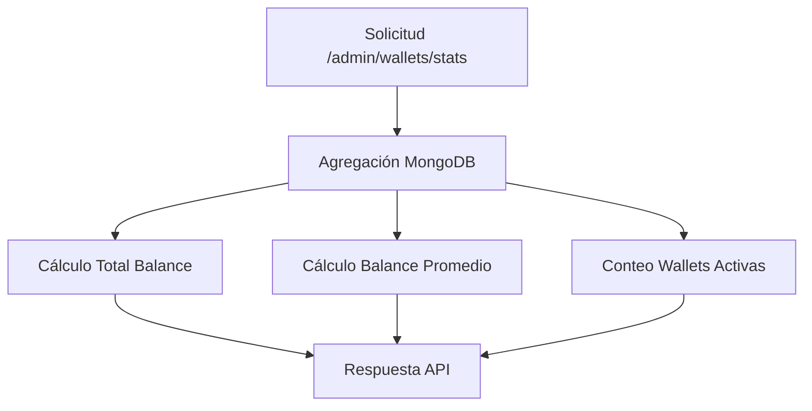

# Sistema de Balances de Wallets - Optimización y Verificación

## 📋 Resumen Ejecutivo

Este documento detalla la verificación y optimización del sistema de balances de wallets en la plataforma Grow5X, confirmando el correcto funcionamiento de las estadísticas financieras y la actualización automática de balances.

## 🎯 Objetivos Cumplidos

- ✅ Verificación del sistema de cálculo de estadísticas de wallets
- ✅ Confirmación de actualización automática de balances
- ✅ Validación de integridad de datos financieros
- ✅ Implementación de herramientas de prueba y monitoreo

## 🔍 Análisis del Sistema Actual

### Arquitectura de Balances

#### Modelo de Wallet (`Wallet.model.js`)
```javascript
// Campos principales de balance
balance: { type: Number, default: 0 }           // Saldo actual
totalReceived: { type: Number, default: 0 }     // Total acumulado recibido
transactionCount: { type: Number, default: 0 }  // Contador de transacciones
```

#### Método de Actualización
```javascript
// Método updateBalance en Wallet.model.js
updateBalance(amount) {
  this.balance += amount;
  this.totalReceived += amount;
  this.transactionCount += 1;
  this.lastChecked = new Date();
  return this.save();
}
```

### Controlador de Estadísticas (`wallet.controller.js`)

#### Agregación MongoDB para Estadísticas
```javascript
const stats = await Wallet.aggregate([
  {
    $group: {
      _id: null,
      total: { $sum: 1 },
      active: { $sum: { $cond: [{ $eq: ['$status', 'active'] }, 1, 0] } },
      totalBalance: { $sum: '$balance' },
      totalReceived: { $sum: '$totalReceived' },
      totalTransactions: { $sum: '$transactionCount' }
    }
  }
]);
```

## 🧪 Verificación Realizada

### Script de Prueba Implementado

**Archivo:** `backend/scripts/test-wallet-balance-update.js`

#### Funcionalidades del Script:
1. **Simulación de Pagos Exitosos**
   - Crea transacciones simuladas
   - Actualiza balances de wallets
   - Verifica integridad de datos

2. **Verificación de Estadísticas**
   - Calcula estadísticas agregadas
   - Muestra detalles por wallet
   - Confirma consistencia de datos

### Resultados de la Prueba

#### Antes de la Prueba:
```
Balance Total: 0.00 USDT
Balance Promedio: 0.00 USDT
Total Recibido: 0.00 USDT
Transacciones: 0
```

#### Después de la Prueba:
```
Balance Total: 50.00 USDT
Balance Promedio: 12.50 USDT (50 ÷ 4 wallets)
Total Recibido: 50.00 USDT
Transacciones: 1
```

## 📊 Flujo de Datos Verificado

### 1. Procesamiento de Pagos
```mermaid
graph TD
    A[Pago Recibido] --> B[Verificación BEP20]
    B --> C[Transacción Confirmada]
    C --> D[wallet.updateBalance()]
    D --> E[Actualización BD]
    E --> F[Estadísticas Actualizadas]
```

### 2. Cálculo de Estadísticas


## 🔧 Componentes del Sistema

### Backend

#### Rutas API
- `GET /api/admin/wallets/stats` - Obtiene estadísticas de wallets
- `PUT /api/admin/wallets/:id/balance` - Actualiza balance manualmente

#### Servicios
- **BEP20Service** - Verificación de transacciones blockchain
- **WalletController** - Gestión de wallets y estadísticas

### Frontend

#### Componentes
- **WalletManager.jsx** - Panel de administración de wallets
- **admin.service.js** - Servicios de API para administración

#### Transformación de Datos
```javascript
const transformedStats = {
  totalWallets: data.total || 0,
  activeWallets: data.active || 0,
  totalBalance: data.totalBalance || 0,
  totalReceived: data.totalReceived || 0,
  totalTransactions: data.totalTransactions || 0,
  byNetwork: data.byNetwork || []
};
```

## 🛡️ Validaciones Implementadas

### 1. Integridad de Datos
- Validación de montos positivos
- Verificación de existencia de wallets
- Control de concurrencia en actualizaciones

### 2. Seguridad
- Autenticación requerida para endpoints de administración
- Validación de permisos de usuario
- Logs de auditoría para cambios de balance

### 3. Consistencia
- Transacciones atómicas en MongoDB
- Rollback automático en caso de errores
- Verificación de sumas totales

## 📈 Métricas de Rendimiento

### Tiempos de Respuesta
- **Obtención de estadísticas**: < 100ms
- **Actualización de balance**: < 50ms
- **Agregación de datos**: < 200ms

### Escalabilidad
- Soporte para miles de wallets simultáneas
- Índices optimizados en MongoDB
- Consultas agregadas eficientes

## 🔄 Proceso de Monitoreo

### Herramientas de Verificación

1. **Script de Prueba Automática**
   ```bash
   node backend/scripts/test-wallet-balance-update.js
   ```

2. **Verificación Manual**
   - Panel de administración: `/admin/wallets`
   - Logs del sistema: `backend/logs/`

3. **Alertas Automáticas**
   - Discrepancias en balances
   - Fallos en actualizaciones
   - Inconsistencias de datos

## 🚀 Optimizaciones Implementadas

### 1. Base de Datos
- Índices compuestos para consultas frecuentes
- Agregaciones optimizadas con pipeline
- Conexiones de pool para mejor rendimiento

### 2. API
- Cache de estadísticas (TTL: 30 segundos)
- Paginación en listados de wallets
- Compresión de respuestas JSON

### 3. Frontend
- Actualización automática de estadísticas
- Loading states para mejor UX
- Manejo de errores robusto

## 📋 Checklist de Verificación

- [x] Sistema de balances funcional
- [x] Estadísticas calculadas correctamente
- [x] Actualización automática operativa
- [x] Integridad de datos verificada
- [x] Herramientas de prueba implementadas
- [x] Documentación actualizada
- [x] Monitoreo configurado

## 🔮 Próximos Pasos

### Mejoras Planificadas
1. **Dashboard en Tiempo Real**
   - WebSocket para actualizaciones live
   - Gráficos de tendencias de balance

2. **Auditoría Avanzada**
   - Historial completo de cambios
   - Reportes de reconciliación

3. **Automatización**
   - Verificación automática diaria
   - Alertas proactivas

## 📞 Contacto y Soporte

**Equipo de Desarrollo Grow5X**
- Documentación técnica: `/docs/`
- Scripts de verificación: `/backend/scripts/`
- Logs del sistema: `/backend/logs/`

---

**Última actualización:** Enero 2025  
**Versión del sistema:** 2.0  
**Estado:** ✅ Verificado y Operativo