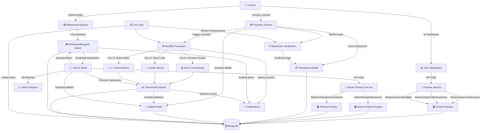
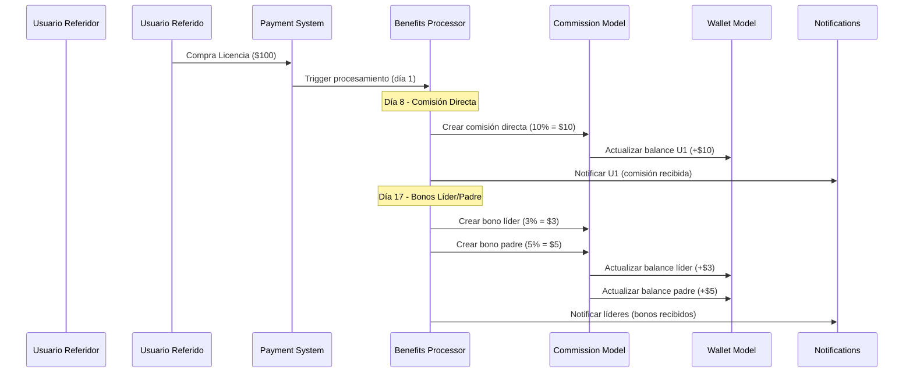
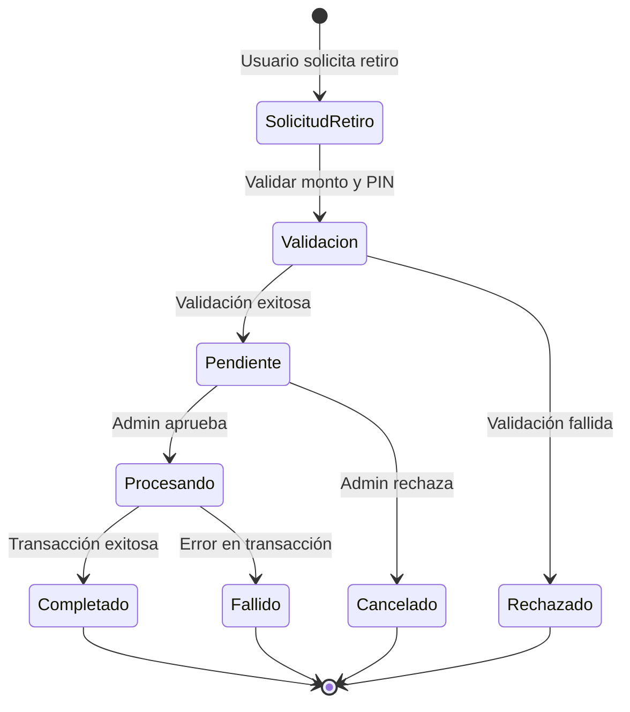
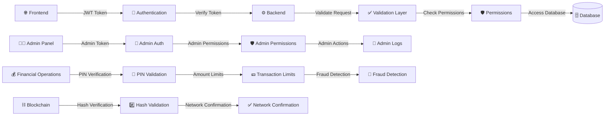
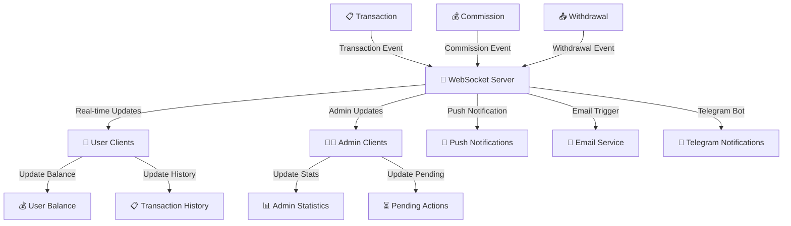
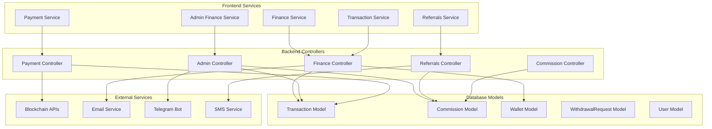
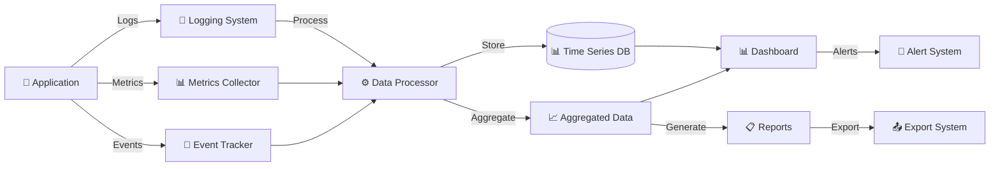
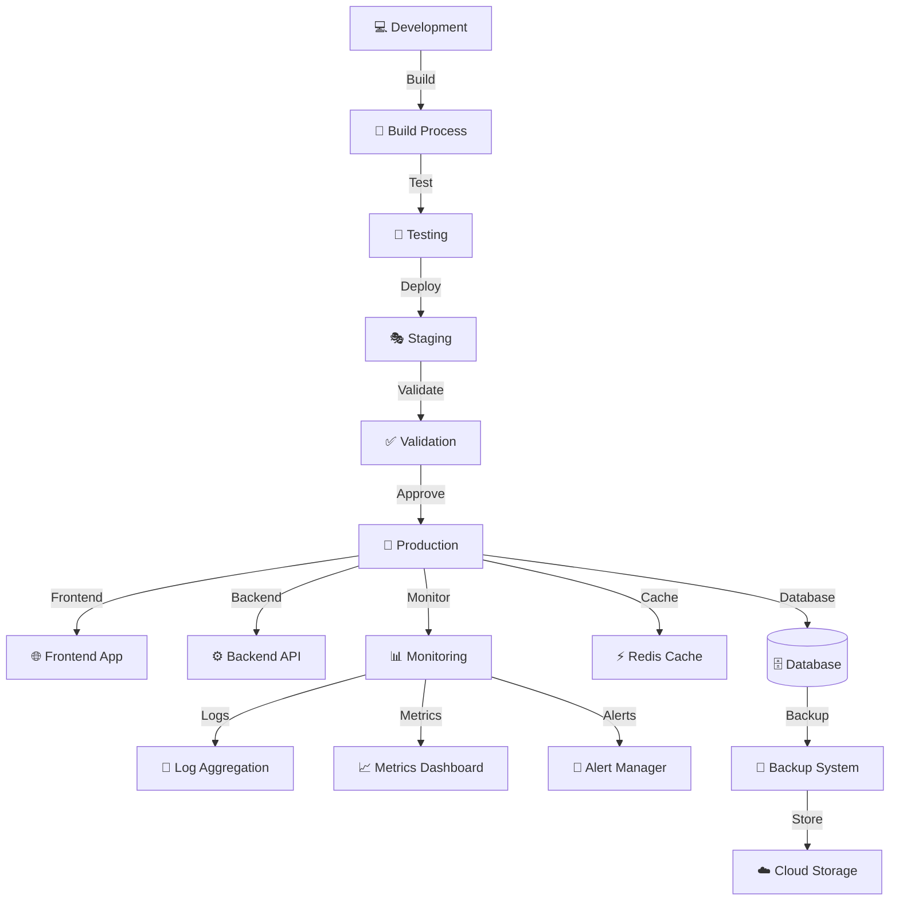

# DIAGRAMA DE FLUJO FINANCIERO - GROWX5

## 🔄 FLUJO PRINCIPAL DE DATOS FINANCIEROS

---

## 💰 FLUJO ESPECÍFICO DE COMISIONES

---

## 🏦 FLUJO DE RETIROS

---

## 🔐 ARQUITECTURA DE SEGURIDAD

---

## 📊 FLUJO DE DATOS EN TIEMPO REAL

---

## 🔄 INTEGRACIÓN DE SERVICIOS

---

## 📈 MÉTRICAS Y MONITOREO

---

## 🔧 CONFIGURACIÓN Y DEPLOYMENT

---

*Diagramas generados para visualizar el flujo completo del sistema financiero GrowX5*
*Versión: 1.0*
*Fecha: $(date)*