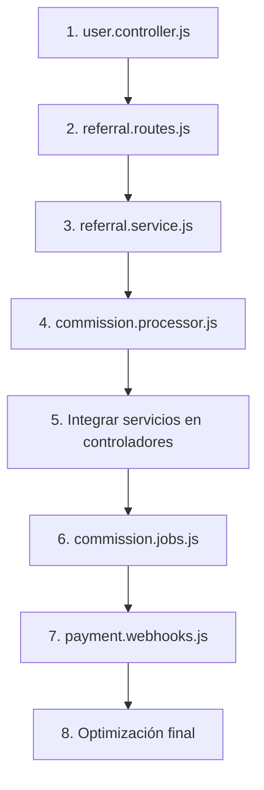

# 🔗 LÍNEA DE CONEXIÓN - SISTEMA REFERIDOS

**Propósito**: Evitar duplicación de optimizaciones y mantener coherencia en el desarrollo  
**Fecha de Creación**: 31 de Enero de 2025  
**Estado**: 🟢 ACTIVO

---

## 📋 COMPONENTES EXISTENTES - NO DUPLICAR

### ✅ MODELOS DE DATOS (100% COMPLETOS)
**Ubicación**: `backend/src/models/`

| Archivo | Estado | Funcionalidades | Línea de Conexión |
|---------|--------|-----------------|-------------------|
| `User.js` | ✅ COMPLETO | referralCode, referredBy, referralStats | **NO MODIFICAR** - Usar tal como está |
| `Referral.js` | ✅ COMPLETO | Relaciones de referido, niveles, estados | **NO MODIFICAR** - Usar tal como está |
| `Commission.js` | ✅ COMPLETO | Comisiones, tipos, estados, pagos | **NO MODIFICAR** - Usar tal como está |
| `SpecialCode.js` | ✅ COMPLETO | Códigos especiales, bonos segunda semana | **NO MODIFICAR** - Usar tal como está |

**🚨 REGLA CRÍTICA**: Los modelos están finalizados. Cualquier cambio debe ser discutido y aprobado.

---

### ✅ CONTROLADORES BACKEND (80% COMPLETOS)
**Ubicación**: `backend/src/controllers/`

| Archivo | Estado | Funcionalidades Existentes | Línea de Conexión |
|---------|--------|----------------------------|-------------------|
| `auth.controller.js` | 🟡 OPTIMIZAR | generateReferralCode(), validateReferralCode() | **OPTIMIZAR** - Integrar con ReferralService |
| `payment.controller.js` | 🟡 OPTIMIZAR | processReferralCommission() | **OPTIMIZAR** - Integrar con CommissionProcessor |
| `specialCodes.controller.js` | 🟡 OPTIMIZAR | Gestión comisiones segunda semana | **OPTIMIZAR** - Integrar servicios |
| `user.controller.js` | 🔴 CRÍTICO | getReferralStats(), getReferrals(), getCommissionHistory() | **CRÍTICO** - Eliminar mock data |
| `admin.controller.js` | 🟡 OPTIMIZAR | Búsqueda por referralCode, estadísticas | **OPTIMIZAR** - Usar servicios centralizados |

**🚨 REGLA CRÍTICA**: NO crear nuevos controladores. Optimizar los existentes.

---

### ✅ RUTAS API (90% COMPLETAS)
**Ubicación**: `backend/src/routes/`

| Archivo | Estado | Funcionalidades | Línea de Conexión |
|---------|--------|-----------------|-------------------|
| `referral.routes.js` | 🔴 CRÍTICO | Todas las rutas con mockReferralData | **CRÍTICO** - Conectar con BD real |
| `auth.routes.js` | ✅ COMPLETO | Rutas de autenticación con referidos | **NO MODIFICAR** - Funciona correctamente |
| `payment.routes.js` | ✅ COMPLETO | Rutas de pagos con comisiones | **NO MODIFICAR** - Funciona correctamente |

**🚨 REGLA CRÍTICA**: `referral.routes.js` es prioridad #1. Eliminar mock data.

---

### ✅ COMPONENTES FRONTEND (100% COMPLETOS)
**Ubicación**: `frontend/src/components/referrals/`

| Archivo | Estado | Funcionalidades | Línea de Conexión |
|---------|--------|-----------------|-------------------|
| `ReferralStats.jsx` | ✅ COMPLETO | Estadísticas completas de referidos | **NO MODIFICAR** - Funciona perfectamente |
| `ReferralList.jsx` | ✅ COMPLETO | Lista con filtros y ordenamiento | **NO MODIFICAR** - Funciona perfectamente |
| `CommissionList.jsx` | ✅ COMPLETO | Lista de comisiones con filtros | **NO MODIFICAR** - Funciona perfectamente |

**🚨 REGLA CRÍTICA**: Frontend está completo. NO tocar estos archivos.

---

### ✅ SERVICIOS FRONTEND (100% COMPLETOS)
**Ubicación**: `frontend/src/services/`

| Archivo | Estado | Funcionalidades | Línea de Conexión |
|---------|--------|-----------------|-------------------|
| `referrals.service.js` | ✅ COMPLETO | API calls para referidos y comisiones | **NO MODIFICAR** - Funciona correctamente |
| `adminReferrals.service.js` | ✅ COMPLETO | API calls para admin de referidos | **NO MODIFICAR** - Funciona correctamente |

**🚨 REGLA CRÍTICA**: Servicios frontend están finalizados. NO modificar.

---

## 🚫 COMPONENTES FALTANTES - CREAR NUEVOS

### ❌ SERVICIOS BACKEND (0% COMPLETOS)
**Ubicación**: `backend/src/services/` - **CREAR NUEVOS**

| Archivo a Crear | Prioridad | Funcionalidades Requeridas | Línea de Conexión |
|-----------------|-----------|----------------------------|-------------------|
| `referral.service.js` | 🔴 CRÍTICA | validateReferralCode(), createReferralRelation(), calculateMultilevelCommissions() | **CREAR NUEVO** - Centralizar lógica de referidos |
| `commission.processor.js` | 🔴 CRÍTICA | processCommissions(), calculateSpecialCommissions(), distributeDirectCommissions() | **CREAR NUEVO** - Centralizar procesamiento |

**🚨 REGLA CRÍTICA**: Estos archivos NO existen. Deben crearse desde cero.

---

### ❌ AUTOMATIZACIÓN (0% COMPLETOS)
**Ubicación**: `backend/src/jobs/` y `backend/src/webhooks/` - **CREAR NUEVOS**

| Archivo a Crear | Prioridad | Funcionalidades Requeridas | Línea de Conexión |
|-----------------|-----------|----------------------------|-------------------|
| `commission.jobs.js` | 🟡 ALTA | Cron jobs para procesamiento automático | **CREAR NUEVO** - Automatización |
| `payment.webhooks.js` | 🟡 ALTA | Webhooks para eventos de pago | **CREAR NUEVO** - Eventos automáticos |

**🚨 REGLA CRÍTICA**: Directorios `jobs/` y `webhooks/` no existen. Crear estructura completa.

---

## 🎯 MAPA DE DEPENDENCIAS

### 📊 Orden de Optimización (OBLIGATORIO)



**🚨 REGLA CRÍTICA**: Seguir este orden exacto. NO saltar pasos.

---

## 🔍 PUNTOS DE CONEXIÓN CRÍTICOS

### 🚨 DATOS MOCK - ELIMINAR INMEDIATAMENTE

#### 📍 user.controller.js (Líneas 168-314)
```javascript
// ❌ ELIMINAR ESTAS LÍNEAS:
const mockReferralStats = { /* ... */ };
const mockReferrals = [ /* ... */ ];
const mockCommissions = [ /* ... */ ];

// ✅ REEMPLAZAR CON:
// Consultas reales a modelos Referral y Commission
```

#### 📍 referral.routes.js (Líneas 7-71)
```javascript
// ❌ ELIMINAR ESTE BLOQUE COMPLETO:
const mockReferralData = {
  // Todo el objeto mock
};

// ✅ REEMPLAZAR CON:
// Importar servicios y usar consultas reales
```

**🚨 REGLA CRÍTICA**: Estos son los únicos puntos con datos mock. Eliminar completamente.

---

### 🔗 PUNTOS DE INTEGRACIÓN

#### 📍 auth.controller.js - Función generateReferralCode()
```javascript
// 🟡 OPTIMIZAR - Línea ~45
// ACTUAL: Lógica directa en controlador
// OBJETIVO: Usar ReferralService.generateCode()
```

#### 📍 payment.controller.js - Función processReferralCommission()
```javascript
// 🟡 OPTIMIZAR - Línea ~120
// ACTUAL: Lógica directa en controlador
// OBJETIVO: Usar CommissionProcessor.processCommissions()
```

#### 📍 specialCodes.controller.js - Gestión de comisiones
```javascript
// 🟡 OPTIMIZAR - Múltiples funciones
// ACTUAL: Lógica dispersa
// OBJETIVO: Centralizar en CommissionProcessor
```

**🚨 REGLA CRÍTICA**: NO duplicar lógica. Mover a servicios centralizados.

---

## 📝 REGISTRO DE CONEXIONES

### 🔄 Conexiones Activas

| Fecha | Componente | Acción | Estado | Responsable |
|-------|------------|--------|--------|-----------|
| 31/01/2025 | LINEA-CONEXION-OPTIMIZACION.md | Creación | ✅ ACTIVO | Sistema |
| - | - | - | - | - |

### 🚫 Conexiones Bloqueadas

| Componente | Razón del Bloqueo | Fecha Bloqueo | Acción Requerida |
|------------|-------------------|---------------|------------------|
| Ninguno | - | - | - |

---

## ⚠️ ALERTAS DE DUPLICACIÓN

### 🚨 ANTES DE CREAR CUALQUIER ARCHIVO:

1. **✅ VERIFICAR**: ¿El archivo ya existe?
2. **✅ CONSULTAR**: ¿Está en la lista de "NO DUPLICAR"?
3. **✅ CONFIRMAR**: ¿Es realmente necesario crear uno nuevo?
4. **✅ DOCUMENTAR**: Actualizar esta línea de conexión

### 🚨 ANTES DE MODIFICAR CUALQUIER ARCHIVO:

1. **✅ VERIFICAR**: ¿Está marcado como "NO MODIFICAR"?
2. **✅ CONSULTAR**: ¿La modificación está en el plan?
3. **✅ CONFIRMAR**: ¿No rompe funcionalidades existentes?
4. **✅ DOCUMENTAR**: Registrar cambios en el checklist

---

## 🎯 OBJETIVOS DE CONEXIÓN

### ✅ Evitar Duplicación
- **0** archivos duplicados
- **0** funciones duplicadas
- **0** lógica repetida

### ✅ Mantener Coherencia
- **100%** de componentes conectados
- **100%** de dependencias mapeadas
- **100%** de cambios documentados

### ✅ Optimizar Eficiencia
- **Máximo 3 fases** de optimización
- **Mínimo tiempo** de desarrollo
- **Máxima reutilización** de código existente

---

## 📞 CONTACTOS DE EMERGENCIA

### 🚨 Si encuentras duplicación:
1. **DETENER** inmediatamente el desarrollo
2. **CONSULTAR** esta línea de conexión
3. **DOCUMENTAR** el conflicto encontrado
4. **RESOLVER** antes de continuar

### 🚨 Si necesitas crear archivo "prohibido":
1. **JUSTIFICAR** por qué es absolutamente necesario
2. **DOCUMENTAR** el impacto en componentes existentes
3. **ACTUALIZAR** esta línea de conexión
4. **PROCEDER** solo con aprobación

---

**🔗 LÍNEA DE CONEXIÓN ACTIVA**  
**Última Actualización**: 31/01/2025  
**Próxima Revisión**: Cada modificación de archivo  
**Estado**: 🟢 OPERATIVA